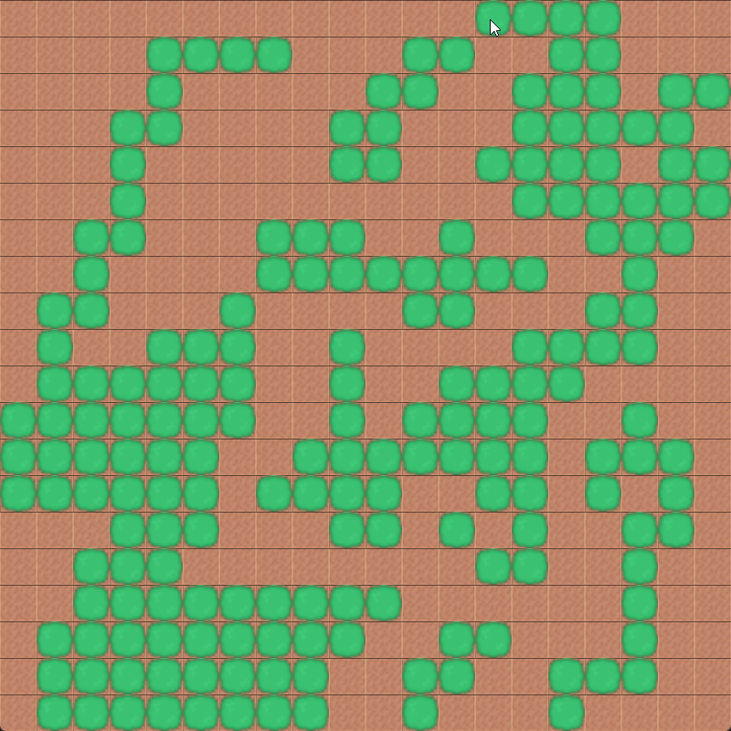

# SDL Grid

### Tile System
- Stores tiles and sprites in a 2D grid matrix
- **Interactive editing**:
    - Left-click to place/remove tiles or sprites
- **Traversal rules**:
    - Configurable walkable/non-walkable states

### Pathfinding (BFS)
- Finds the shortest path between points
- **Modes**:
    - Dynamic: Path follows mouse cursor
    - Static: Set custom start/end positions

